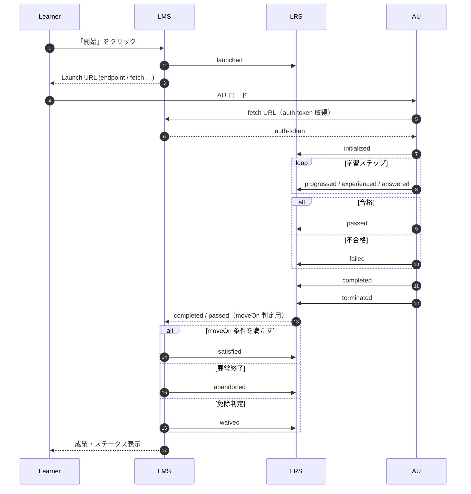

# Activity Stream  
xAPI Profileで公開されている[Activity Stream](https://github.com/adlnet/xapi-authored-profiles/blob/master/activity-streams/activity-streams.jsonld)については、背景にW3Cの[Activity Stream](https://github.com/w3c/activitystreams)があり、一般的な語彙の参照先候補としては良さそうに見える    

# [Architecture desision record(ADR)](https://github.com/joelparkerhenderson/architecture-decision-record?tab=readme-ov-file#what-is-an-architecture-decision-record)  
[ADRのためのチームワークのアドバイス](https://github.com/joelparkerhenderson/architecture-decision-record?tab=readme-ov-file#teamwork-advice-for-adrs)  
チームで意思決定レコードを使用することを検討している場合は、多くのチームと協力して学んだアドバイスをいくつか紹介します。

チームメイトをリードする機会は、「何を」を強制するのではなく、「なぜ」について一緒に話し合うことです。たとえば、意思決定記録は、チームがより賢く考え、コミュニケーションを改善するための方法です。決定記録は、事後的に強制された事務処理の要件にすぎない場合、価値がありません。

一部のチームは、「ADRs」という略語よりも「Decisions」という名前をはるかに好みます。一部のチームがディレクトリ名「決定」を使用すると、電球が点灯し、チームがベンダーの決定、計画の決定、スケジュールの決定など、より多くの情報をディレクトリに入力し始めます。これらの種類の情報はすべて、同じテンプレートを使用できます。私たちは、人々は略語(「ADR」)よりも単語(「決定」)の方が学習が速く、"レコード"という言葉が削除されると、人々は進行中のドキュメントを書く意欲が高まり、一部の開発者や一部のマネージャーは"アーキテクチャ"という言葉を嫌うという仮説を立てています。

理論的には、不変性が理想的です。実際には、可変性は私たちのチームにとってより適切に機能しています。新しい情報を既存のADRに挿入し、日付スタンプと、決定後に情報が到着したというメモを挿入します。このようなアプローチは、私たち全員が更新できる「生きたドキュメント」につながります。典型的な更新は、新しいチームメイト、新しいサービス、実際の使用状況の結果、またはベンダーの機能、価格プラン、ライセンス契約などの事後のサードパーティの変更のおかげで情報を取得する場合です。

# [cmi5](https://github.com/AICC/CMI-5_Spec_Current)  

## ツール間の連携フロー

#### LRS ➜ LMS 通知の描き方
物理的には API Callback・メッセージキュー・ポーリングなど実装依存ですが、「AU→LRS→LMS」 の情報経路を示すことで「LMS は自前で completed/passed を発行しない」点を明確にしています。
satisfied / abandoned / waived は LMS が主体。
ブロック／コース完了、異常終了、受講免除といった管理判断を LRS へ記録します。

#### Moodleの公式プラグインの場合
https://github.com/davidpesce/moodle-mod_tincanlaunch  

